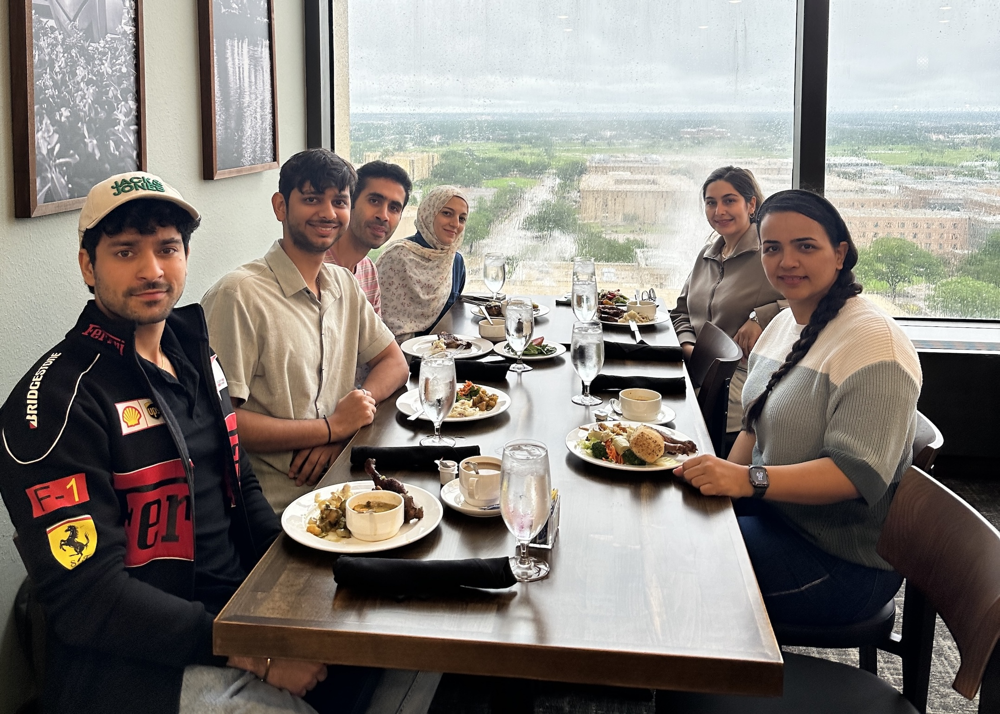

```{=html}
<div class="hero-banner">
  <div class="hero-grid">
    <div class="hero-text">
      <div class="hero-title">Laboratory for Advancing Sustainable Energy Resilience (LASER)</div>
      <p class="hero-subtitle">Welcome to the Elnaz Kabir Research Group</p>
    </div>
    <div class="hero-image">
      <div class="carousel">
        <div class="carousel-track">
          
          
        </div>
        <button class="carousel-btn carousel-prev" aria-label="Previous">‹</button>
        <button class="carousel-btn carousel-next" aria-label="Next">›</button>
        <div class="carousel-dots">
          <button class="carousel-dot active" data-index="0" aria-label="Slide 1"></button>
          <button class="carousel-dot" data-index="1" aria-label="Slide 2"></button>
        </div>
      </div>
    </div>
  </div>
</div>
```

:::: {.columns}

::: {.column width="55%"}

The electric power grid is the backbone of modern society, enabling nearly every other critical infrastructure. As electrification expands, AI data centers and reshored manufacturing add major new demand, and extreme weather events become more disruptive, the role of the grid becomes even more vital. At the same time, the energy transition is reshaping how we plan and operate the grid. More renewables, storage, and decentralized resources—along with fast-growing large loads—are making electricity supply and demand more variable and more weather-sensitive, increasing uncertainty and operational challenges.

Our research group develops and applies advanced analytics to model, optimize, and strengthen future energy systems under uncertainty, with a focus on renewable-rich, electrified, decentralized, and interdependent networks. Our interdisciplinary, mission-driven work includes weather-informed forecasting of renewable generation, electricity demand, and prices; modeling storm and hurricane impacts on outages and restoration; and planning and operating power systems with high levels of renewables and storage using stochastic, robust, and data-driven optimization methods. We also study hydrogen integration as a long-duration energy storage option and industrial supply chains as flexible, grid-interactive resources that coordinate production and logistics decisions with grid conditions.

:::

::: {.column width="3%"}
:::

::: {.column width="42%" .news-column}

::: {.news-heading}
News & Updates
:::

::: {#news-home}
:::

[View Full Archive →](/news/){.news-archive-link}

:::

::::

```{=html}
<script>
document.addEventListener('DOMContentLoaded', function() {
  const slides = document.querySelectorAll('.carousel-slide');
  const dots = document.querySelectorAll('.carousel-dot');
  const prevBtn = document.querySelector('.carousel-prev');
  const nextBtn = document.querySelector('.carousel-next');
  if (!slides.length) return;

  let currentIndex = 0;
  let autoplayTimer;

  function goToSlide(index) {
    slides[currentIndex].classList.remove('active');
    dots[currentIndex].classList.remove('active');
    currentIndex = (index + slides.length) % slides.length;
    slides[currentIndex].classList.add('active');
    dots[currentIndex].classList.add('active');
  }

  function nextSlide() { goToSlide(currentIndex + 1); }
  function prevSlide() { goToSlide(currentIndex - 1); }

  function startAutoplay() {
    autoplayTimer = setInterval(nextSlide, 5000);
  }
  function stopAutoplay() {
    clearInterval(autoplayTimer);
  }

  if (nextBtn) nextBtn.addEventListener('click', () => { stopAutoplay(); nextSlide(); startAutoplay(); });
  if (prevBtn) prevBtn.addEventListener('click', () => { stopAutoplay(); prevSlide(); startAutoplay(); });

  dots.forEach(dot => {
    dot.addEventListener('click', () => {
      stopAutoplay();
      goToSlide(parseInt(dot.dataset.index));
      startAutoplay();
    });
  });

  const carousel = document.querySelector('.carousel');
  if (carousel) {
    carousel.addEventListener('mouseenter', stopAutoplay);
    carousel.addEventListener('mouseleave', startAutoplay);
  }

  startAutoplay();
});
</script>
```